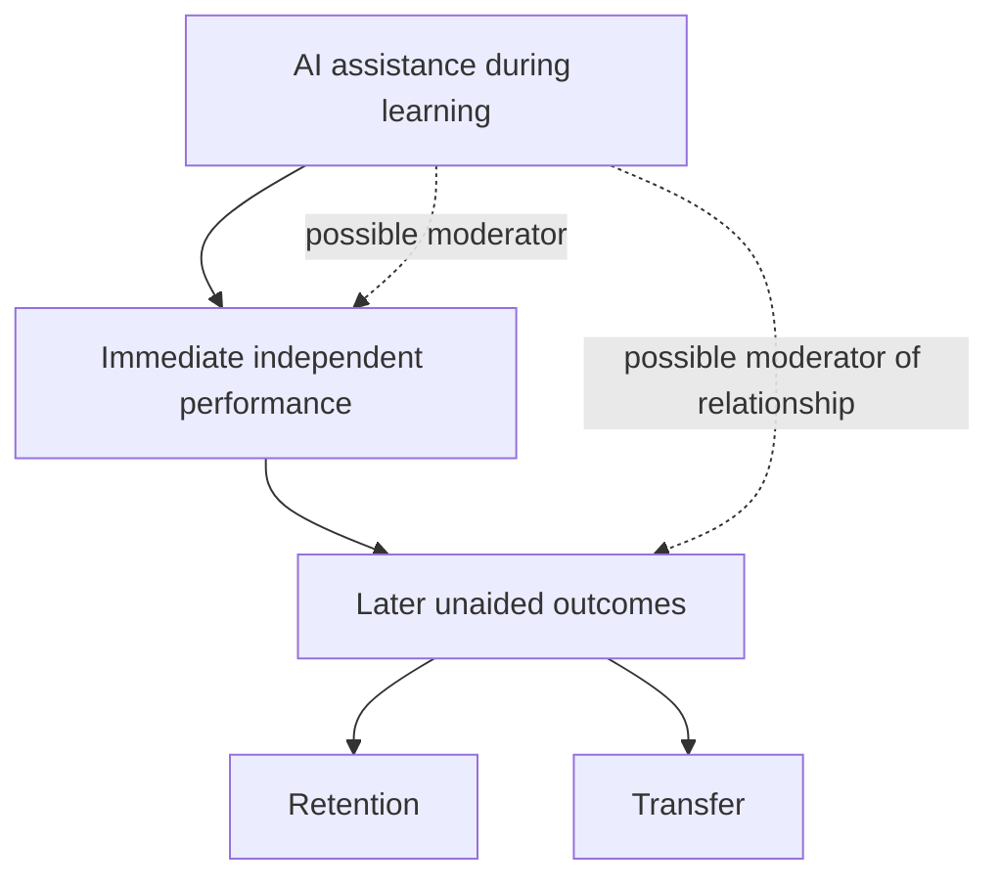
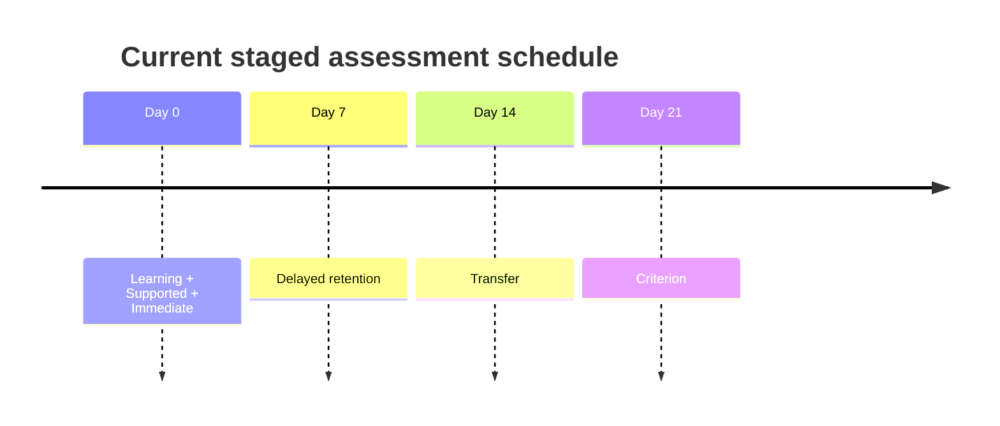

# AI-Assisted Learning — Research Design & Project Documentation

This is the main professor-facing description of the project. It describes the
current repository implementation and should be read with the active documents
listed in [research/README.md](../research/README.md). Historical specifications
remain available in [research/archive/](../research/archive/).

## 1. Abstract

This project is a research instrument for studying how AI assistance during
learning relates to later unaided learning outcomes. The initial experimental
testbed is a controlled Python programming module about loop-based problem
solving. Learners are randomly assigned to a No-AI or Controlled-AI condition,
complete standardized learning and assessment stages, and are assessed without
AI at immediate, delayed, transfer, and criterion stages. The repository
implements provenance capture, scheduled attempts, controlled AI access, and
execution-based grading for an internal content/feasibility pilot. It does not
yet establish that AI improves learning.

## 2. Research Problem

AI can help a learner complete a task while leaving open whether the learner
can subsequently perform the skill independently. The central problem is
therefore to separate assistance during learning from unaided evidence of
retention and transfer.

## 3. Motivation

The project treats AI assistance as an experimental condition rather than as a
general-purpose tutoring product. A controlled intervention, common learning
material, AI-free assessments, and preserved version provenance make it
possible to study immediate independent performance and later outcomes together.

## 4. Research Questions

**Primary:** How does AI assistance during learning affect learners'
subsequent unaided retention and transfer of the learned skill?

**Secondary:** Does AI assistance change the relationship between immediate
independent performance and subsequent unaided learning outcomes?

Programming is the **initial experimental testbed**, not the scope of the
research questions.

## 5. Research Objectives

- Compare immediate unaided performance after No-AI and Controlled-AI learning.
- Measure later unaided retention and transfer.
- Estimate whether condition moderates the relationship between immediate
  independent performance and later outcomes.
- Test whether the tasks, timing, AI policy, logging, and grading are feasible
  and interpretable before confirmatory work.
- Preserve the exact study and AI provenance needed to reproduce frozen
  participants.

## 6. Conceptual Framework



AI condition is treated as a possible moderator of the relationship between
immediate independent performance and later unaided outcomes; the repository
does not assume the direction of an effect.

## 7. Hypotheses

- **H1:** AI assistance during learning is associated with differences in
  immediate unaided performance compared with the No-AI condition.
- **H2:** AI assistance during learning is associated with differences in
  subsequent unaided retention compared with the No-AI condition.
- **H3:** AI assistance during learning is associated with differences in
  subsequent unaided transfer compared with the No-AI condition.
- **H4:** The relationship between immediate independent performance and later
  unaided learning outcomes differs between the AI-assisted and No-AI
  conditions.

These are empirical hypotheses, not claims that AI improves learning.

## 8. Experimental Design

Learners with basic Python prerequisites are randomly assigned at enrollment
to one of two conditions. Both conditions receive the same standardized
learning module, task sequence, timing, environment, and AI-free assessments.
The Controlled-AI condition adds a learner-initiated tutor during Supported
learning only.

| Variable | Role | Current operationalization |
|---|---|---|
| AI condition | Independent variable | `no_ai` or `controlled_ai`, selected at enrollment |
| Immediate performance | Predictor/outcome | Unaided Immediate task score |
| Retention | Outcome | Unaided Delayed task score at approximately Day 7 |
| Transfer | Outcome | Unaided Transfer task score at approximately Day 14 |
| Criterion | Additional outcome | Unaided, more complex application at approximately Day 21 |
| Prior ability / prior knowledge | Background variable | Prior ability can currently be recorded in learner information where applicable |
| Prerequisite screener | Background/eligibility instrument | Documented in [loops_prerequisite_screener_v0.3.md](../research/loops_prerequisite_screener_v0.3.md), but not enforced by the current application runtime |
| AI interactions | Treatment exposure/process measure | Logged interaction count and content for Controlled-AI Supported attempts |
| Time and completion | Feasibility/process measures | Attempt timestamps, scheduling, completion, and Supported end reason |

## 9. Experimental Conditions

| Feature | No-AI | Controlled-AI |
|---|---|---|
| Standardized learning module | Yes | Yes |
| Supported task | Yes | Yes |
| Generative tutor | No | Yes, learner-initiated |
| Tutor availability | None | Active Supported attempt only |
| Independent assessments | AI-free | AI-free |
| Versioned provenance | Common study/module/task provenance | Plus prompt, provider/model, cap, and duration |
| Intended comparison | Reference condition | Controlled intervention condition |

## 10. Participant Workflow

```mermaid
flowchart LR
    A[Eligibility<br/>(research-protocol procedure)] --> B[Random assignment]
    B --> C[No-AI / Controlled-AI]
    C --> D[Standardized learning]
    D --> E[Immediate unaided assessment]
    E --> F[Delayed retention]
    F --> G[Transfer]
    G --> H[Criterion]
```

Eligibility and prerequisite screening are research-protocol procedures, not
an enforced application gate: the current runtime does not require a
prerequisite screener result before learner creation or random assignment.
Prior ability can currently be recorded as part of learner information. The
application freezes relevant provenance when a learner is created, seeds the
staged attempts, permits AI only in the Controlled-AI Supported attempt, and
blocks AI during independent assessments.

## 11. Measurement Framework

| Stage | Purpose | Current task construct | AI available? |
|---|---|---|---|
| Supported | Learning and practice | Count qualifying values in a provided input | Controlled-AI only |
| Immediate | Immediate independent performance | Changed-context conditional count | No |
| Delayed | Unaided retention | Conditional count in a later task | No |
| Transfer | Unaided transfer | Maximum tracking in a related context | No |
| Criterion | More complex application | Longest consecutive streak using current/best state | No |

Every seeded task uses the provided-input plus `result` contract. Learners
must not redefine platform-provided inputs.

## 12. AI Intervention

The current AI policy is learner-initiated and available only during an active
Supported attempt for Controlled-AI learners. The runtime freezes the
following values for those learners:

| Intervention element | Current value |
|---|---|
| Provider | `groq` |
| Model | `llama-3.1-8b-instant` |
| System prompt | `0.6.0` |
| Interaction cap | 8 successful interactions |
| Supported-session limit | 20 minutes |
| Runtime registry | `SYSTEM_PROMPT_REGISTRY`, with historical prompt versions resolvable |

The tutor may provide conceptual guidance, problem decomposition, targeted
hints, tracing and dry-run reasoning, and materially different analogous
examples. It may explain the permitted loop constructs and state patterns.
It must not provide or reconstruct the complete active-task solution,
near-executable code, exact active-task control flow, expected answers,
grading specifications, hidden tests, research hypotheses, or hidden research
variables. It must not personalize treatment, detect struggle, issue automatic
hints, adapt intervention, invent tasks, or use cross-task memory.

The current prompt limits teaching to the module's approved constructs:
variables, assignment, comparisons, `if/else`, basic `for` loops, counters,
accumulators, simple lists/strings, simple arithmetic, and `result`. It
forbids functions, dictionaries, recursion, classes, nested loops, `while`,
`break`, `continue`, comprehensions, advanced libraries, and other shortcuts
outside the approved construct.

## 13. Why Programming Is the Initial Testbed

Programming tasks provide a relatively structured environment in which
learning interventions and subsequent unaided performance can be measured
objectively. They allow consistent task presentation, automated assessment,
controlled AI access, and reproducible experimental conditions. This makes
programming a practical initial testbed; it does **not** limit the broader
research question to programming.

## 14. Initial Learning Domain

The first implementation focuses on introductory Python loop-based problem
solving. The current module teaches variables, assignment, comparisons,
`if/else`, basic `for` loops, counters, accumulators, simple lists and strings,
simple arithmetic, and result/state tracking. Its reasoning sequence is:

`UNDERSTAND -> DECOMPOSE -> INITIALIZE STATE -> ITERATE -> CHECK -> UPDATE -> RESULT`

The module does not teach or require `while`, nested loops, `break`, `continue`,
functions, recursion, dictionaries, comprehensions, advanced libraries, or
advanced algorithms.

## 15. Outcome Measures

The primary implementation outcomes are normalized hidden-case task scores at
Immediate, Delayed, Transfer, and Criterion. The Supported stage is practice,
not a primary independent outcome. Process measures include completion,
timestamps, follow-up scheduling, AI interaction count/content, and
Supported end reason. The current grader uses equal-weight hidden behavioral
cases and version `0.1.0`.

## 16. Experimental Timeline

| Time | Stage | Measurement |
|---|---|---|
| Day 0 | Learning, Supported, Immediate | Learning/practice followed by immediate unaided performance |
| Day 7 | Delayed | Unaided retention |
| Day 14 | Transfer | Unaided transfer |
| Day 21 | Criterion | Unaided criterion application |



The protocol allows working windows around the delayed, transfer, and criterion
targets; exact scheduling is enforced by the application rather than by the
AI tutor.

## 17. Data Collection and Provenance

Learner records preserve study protocol, learning module, task, prompt,
provider/model where applicable, interaction cap, and Supported duration
provenance. Attempts preserve task and grader versions, timestamps, and
Supported end reason after grading. AI interactions preserve the learner
prompt, tutor response, and sequence number. Unknown versions fail closed,
and historical versions remain resolvable for frozen learners.

| Provenance item | Current implementation |
|---|---|
| Study protocol | `v0.4` |
| Learning module configuration | `v0.6.0` |
| Seeded task instrument | `0.5.0` |
| System prompt | `0.6.0` |
| Grader | `0.1.0` |
| AI provider/model | `groq` / `llama-3.1-8b-instant` |
| AI cap and duration | 8 interactions / 20 minutes |

The `v0.4` protocol document contains older descriptive version references in
some sections. The table above reflects the current runtime configuration and
registries; the historical document is preserved rather than rewritten.

## 18. Statistical Analysis Plan

The design's primary confirmatory direction is a model of later unaided
outcomes using immediate performance, condition, and their interaction:

`Later outcome ~ Immediate + Condition + Immediate × Condition`

Exact model choice, exclusions, missing-data rules, multiplicity handling, and
effect-size definition remain to be preregistered after feasibility work. The
current pilot is intended for content, instrument, timing, technical, and
follow-up feasibility, not causal claims about improvement.

## 19. Threats to Validity

Relevant threats include prior ability differences, floor and ceiling effects,
variable AI interaction behavior, unequal time-on-task, attrition at delayed
follow-ups, limited transfer measurement, and the ecological validity of a
narrow scripted task. AI policy adherence and model/provider behavior may also
vary. Random assignment and standardized tasks address some allocation and
presentation concerns, while provenance and interaction logs support auditing.

## 20. Limitations

The initial evidence is specific to one introductory Python construct and a
small staged task set. It should not be generalized to programming as a whole,
other subjects, or AI tutoring generally without additional evidence. Pilot
sample sizes are feasibility-oriented: the content/instrument pilot is
approximately 3–5 suitable participants and the feasibility pilot is
provisionally approximately 8–15; confirmatory sample size is to be determined
prospectively. Attrition, time-on-task, transfer measurement, and policy
adherence remain open empirical limitations.

The current grader runs submissions with `python -I` in a temporary directory
and a timeout. This provides basic isolation but not a true network or
OS-level sandbox. It is therefore suitable only for a trusted/internal
technical pilot, not hostile or public untrusted code execution.

## 21. Current Implementation Status

Implemented components include the FastAPI backend, learner-level random
condition assignment, staged attempts, frozen provenance, Supported-session
expiry, learner-initiated Controlled-AI access, interaction logging, versioned
learning material and prompts, seeded tasks, and execution-based grading.
The current repository describes a content/feasibility pilot and is not a
publication-ready confirmatory platform.

## 22. Planned Research Phases

1. **Content/instrument pilot:** assess clarity, prerequisites, difficulty,
   tutor helpfulness/over-helping, and task interpretation.
2. **Feasibility pilot:** assess follow-up completion, attrition, timing, AI
   usage, technical reliability, and floor/ceiling behavior.
3. **Confirmatory study:** determine sample size and preregister the finalized
   model, exclusions, missing-data rules, and effect assumptions before
   confirmatory collection.

## 23. Ethical / Research-Integrity Considerations

Resolve appropriate consent and ethics requirements before human feasibility or
confirmatory collection. Collect only necessary participant data and follow
approved withdrawal and retention rules. Keep participant-facing deployment
separate from researcher-only prompts, hypotheses, hidden tests, expected
answers, and grader specifications. The repository URL is not participant
material.

## 24. References

This repository does not contain an external bibliography. The authoritative
project references are the versioned internal documents in
[research/README.md](../research/README.md), especially
[protocol_v0.4.md](../research/protocol_v0.4.md),
[loops_learning_module_v0.6.md](../research/loops_learning_module_v0.6.md),
[loops_task_instrument_v0.5.0.md](../research/loops_task_instrument_v0.5.0.md),
[ai_tutor_policy_v0.6.md](../research/ai_tutor_policy_v0.6.md), and
[SCOPE.md](../research/SCOPE.md).
